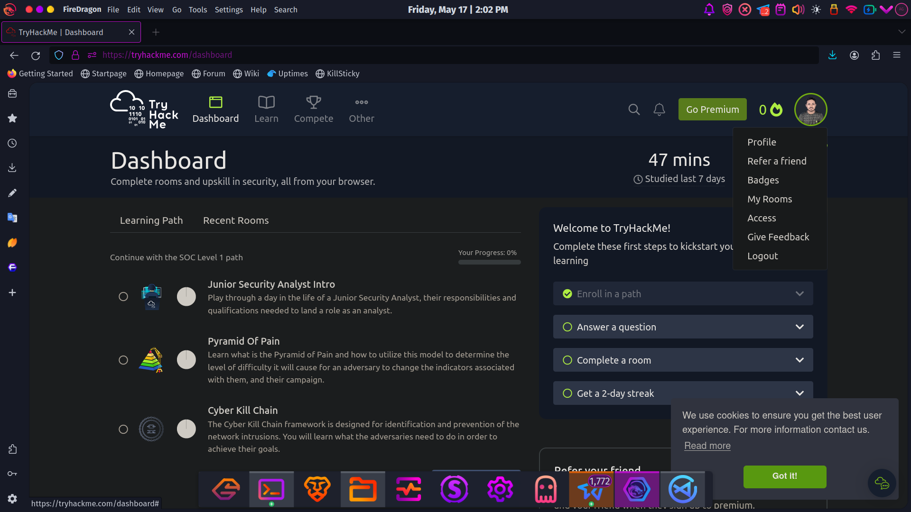
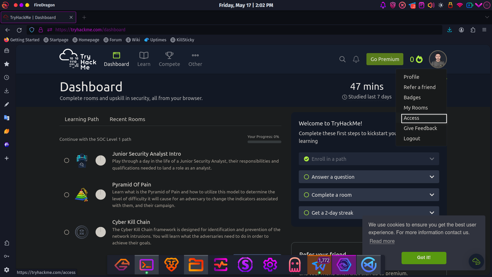
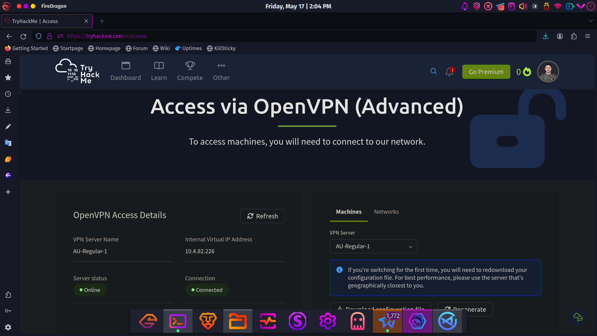
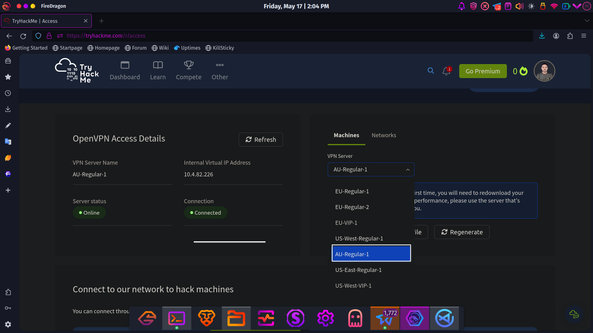
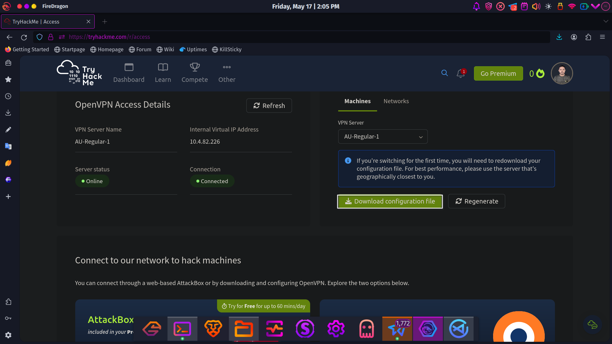
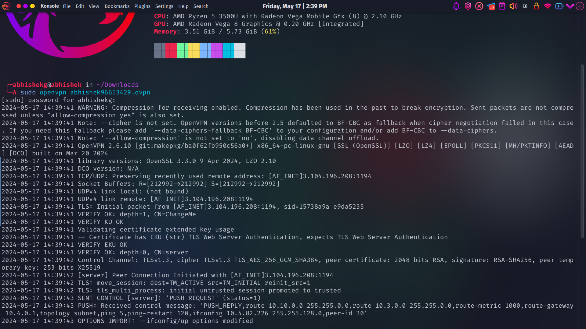
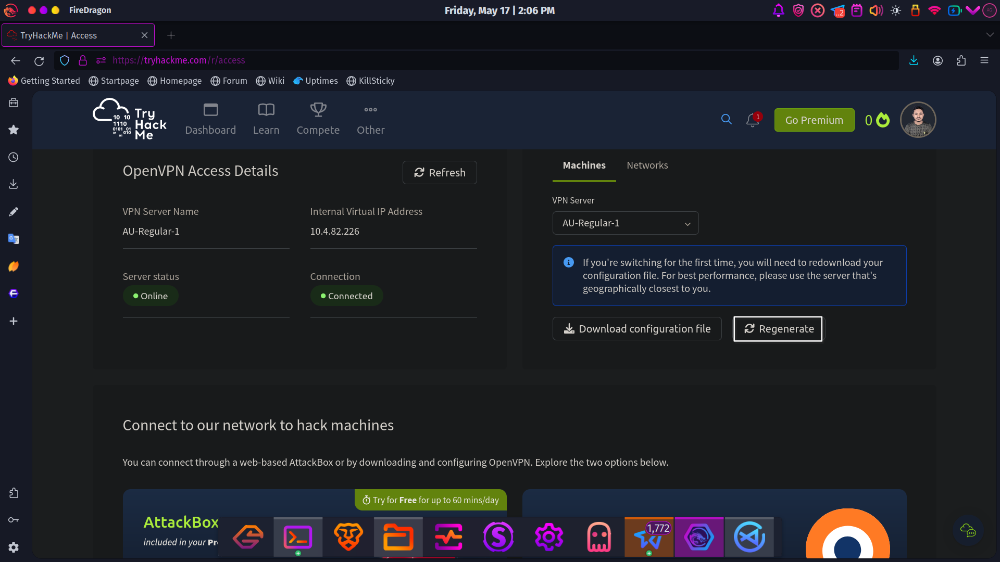
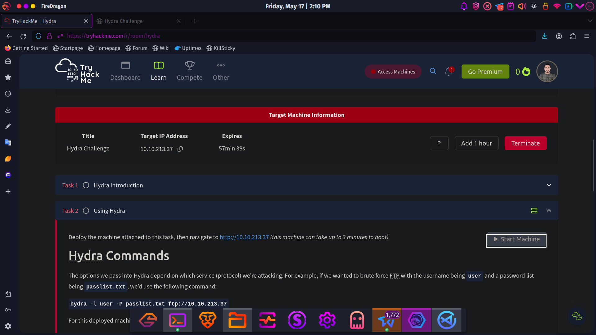
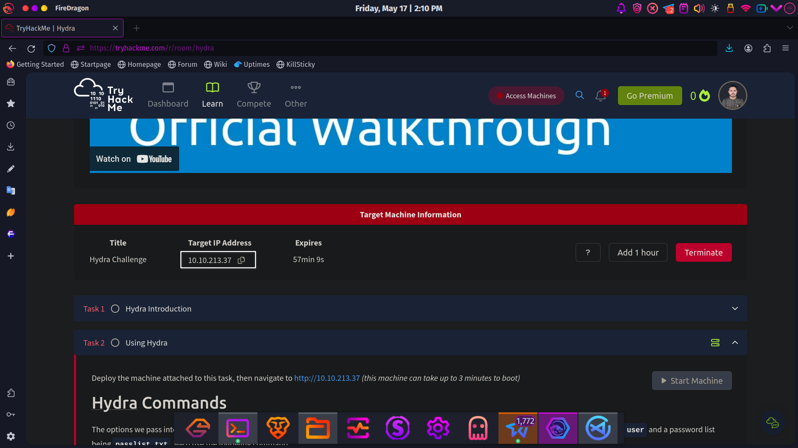
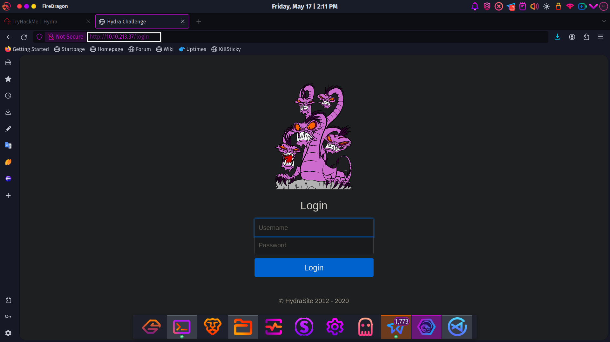

## Try Hackme Lab setup

#### Go to <a href="https://tryhackme.com/"> Try hack me Website</a>

### 1. Login Your Account


### 2. Go to Access



### 3. Then it will give you a  new page



### 4. Go to AU-Regular-1



### 5. click on Download and Config File



<!--  -->
### 6. go to your Downlaod Directory and Open Your Terminal there and type 

```bash
$ sudo openvpn <Your_ovpn_name>
```


### 7. click on Regenrate


### 8. Start Your Lab Machine


### 9. Copy You ip Address


### 10. Go to your Browser and Paste Your ip there

