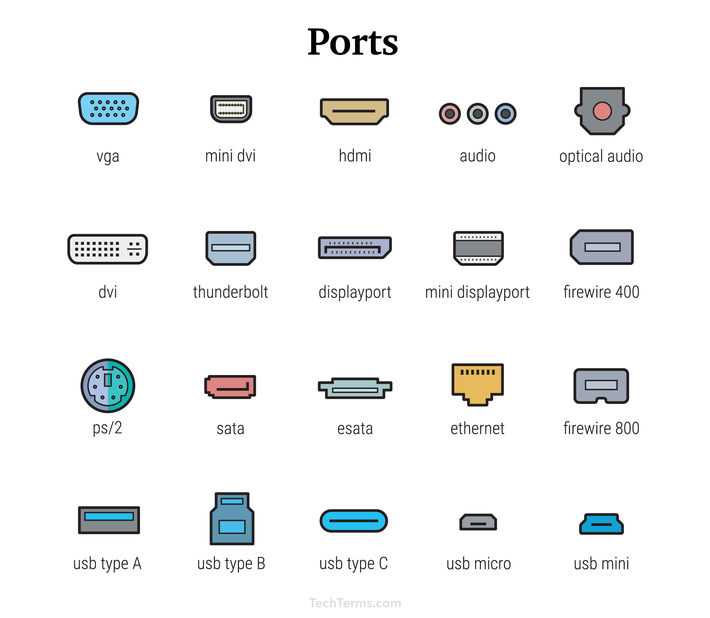

<!-- TOC -->

- [What is Nmap?](#what-is-nmap)
- [What is Scanning](#what-is-scanning)
- [What is Port](#what-is-port)
    - [Type of Port](#type-of-port)
        - [Physical Port](#physical-port)
        - [Logical Port](#logical-port)
- [tcp flag](#tcp-flag)
- [way hand shack](#way-hand-shack)

<!-- /TOC -->

# What is Nmap?

- Nmap is short for Network Mapper. It is an open-source Linux command-line tool that is used to scan IP addresses and ports in a network and to detect installed applications.

- Nmap allows network admins to find which devices are running on their network, discover open ports and services, and detect vulnerabilities.

- Nmap, yaani "Network Mapper," ek shaktishaali open-source network scanning tool hai jo ek computer network par hosts aur services ko discover karne mein madad karta hai, is tarah se network ka "map" banaata hai. Yeh aam taur par network administrators aur security professionals dwaara istemaal kiya jaata hai taaki network ki suraksha ka moolyaankaan kiya ja sake, system inventory ko poora kiya ja sake, service upgrade schedules ko manage kiya ja sake, aur host ya service ki uptime ko monitor kiya ja sake.

- Nmap neelima IP packets ka upayog anokhe tareeke se karta hai jisse yeh nirdhaarit kar sake ki network par kaun kaun se hosts upalabdh hain, kaun kaun se services (application naam aur version) woh hosts offer kar rahe hain, woh kaun se operating systems (aur OS versions) chala rahe hain, kaun sa prakar ka packet filters/firewalls istemaal kiya ja raha hai, aur anya aise gunaankari. Yeh behad laachar hai aur vibhinn network environments aur configurations mein aanukoolit ho sakta hai.

# What is Scanning

- Scanning means carefully checking a network or system to see what devices are there and what services they're using. It helps find any weak points that could be a security risk and lets us make things safer.

- Scanning ka matlab hai network ya system par samagra jaanch karna, jaise Nmap ke dwara kiya jaata hai. Ismein vishesh roop se network ke devices aur unke ports ko check kiya jaata hai, taki pata chal sake ki kaun se devices uplabdh hain aur unmein kaun kaun se services chal rahe hain. Scanning ke through, kisi bhi vulnerabilities ko pehchana ja sakta hai jo security ke liye khatra ho sakta hai, aur iske dwara network ya system ki suraksha mein sudhar kiya ja sakta hai.

- In Scanning We are Try To find Open Ports .

# What is Port

-  A port is like a door or a window on a computer that allows different programs to communicate with each other or with the internet. Each program uses a specific port to send and receive data. Think of it as an entry point where data can flow in and out. Ports are numbered, and each number is assigned to a specific service or application. 

- Port ek computer ka darwaza ya khidki jaise hota hai jisme alag-alag programs ek dusre se ya internet se communicate kar sakte hain. Har program apne data ko bhejne aur prapt karne ke liye ek khaas port ka istemaal karta hai. Isse ek pravesh bindu ki tarah sochiye jahan data pravahit ho sakta hai. Ports ko sankhyaon mein ginaya jata hai, aur har sankhya ko ek vishesh seva ya application ke liye assign kiya jata hai. For example, web servers port 80 ya 443 ka upyog HTTP aur HTTPS traffic ke liye karte hain, jabki email servers port 25 ka upyog emails bhejne ke liye karte hain.

- For example, web servers use port 80 or 443 for HTTP and HTTPS traffic, respectively, while email servers use port 25 for sending emails.

## Type of Port

There are Two Type of Port.

1. Physical Port
2. Logical Port

###  Physical Port

- A physical port is a hardware interface on a device that extends outward and is used to connect to other devices. These ports come in various types, such as USB ports, Ethernet ports, HDMI ports, and audio ports. They facilitate data transfer, network connectivity, audio/video output, and power supply. Physical ports are physical hardware components that come built into devices and aid in connecting them to other devices.

- Physical port ek physical connection point hota hai jo device ke bahar nikalta hai aur dusre devices se connect hone ke liye istemal hota hai. Ye ports alag-alag prakar ke devices ke alag-alag tarikon se jude hote hain, jaise USB ports, Ethernet ports, HDMI ports, aur audio ports. In ports ka upyog data transfer, network connectivity, audio/video output, aur power supply ke liye hota hai, aur ye physical hardware components hote hain jo devices ke saath aate hain.

<!-- - Usb port , RJ45 Port , HDMI Port -->

`What is the Perpose of these Port` 

- The purpose of physical ports varies depending on their type, but generally, they serve the following functions:

`Data Transfer:`

-  Ports like USB allow for the transfer of data between devices, such as connecting external storage drives, printers, and input devices like keyboards and mice.

` Network Connectivity: ` 

- Ports like Ethernet provide a means for devices to connect to local networks or the internet, facilitating communication and data exchange between devices within the network.

`Audio/Video Output:`

-  Ports like HDMI enable devices to transmit high-definition audio and video signals to external displays such as TVs and monitors, enhancing the multimedia experience.

`Power Supply:`

-  Some ports, like USB, can also provide power to connected devices, allowing for charging of smartphones, tablets, and other gadgets.

### Logical Port

- A logical port, existing within software, facilitates communication between applications or services on a network device. Unlike physical ports, they are virtual and identified by port numbers. Logical ports enable data routing to specific applications, enhancing network communication by coordinating multiple services on a device and optimizing data flow within a network.

- Logical port ek software-based endpoint hota hai jo ek network device ya operating system ke andar hota hai aur alag-alag applications ya services ke beech mein communication ko facilitate karta hai. Alag physical ports ke vipreet, jo ki physical hardware interfaces hote hain, logical ports virtual hote hain aur sirf software mein maujood hote hain.

- Logical ports ko unique numbers ya identifiers assign kiye jaate hain, jo ki port numbers ke roop mein jaane jaate hain, alag-alag prakar ke network traffic ko alag kiya ja sake. Ye port numbers incoming data packets ko sahi destination tak pahunchane ke liye istemal kiye jaate hain, jo ki ek device par chal rahe sahi application ya service ko nirdhaarit karta hai.

- Udaharan ke liye, TCP/IP protocol suite mein, logical ports IP addresses ke saath istemal kiye jaate hain taki devices ke beech mein communication ho sake. Har network service ya application jo ek device par chalti hai, use ek vishesh port number assign kiya jaata hai, jo ki incoming data packets ko sahi destination tak pahunchane mein madad karta hai.

- Logical ports network communication mein ek mahatvapurna bhumika nibhate hain kyunki ye ek device par kai network services ko samuhik roop se chalne ki anumati dete hain aur network ke andar data ka eficient routing karte hain.

# tcp flag

#handshack 

# 3 way hand shack